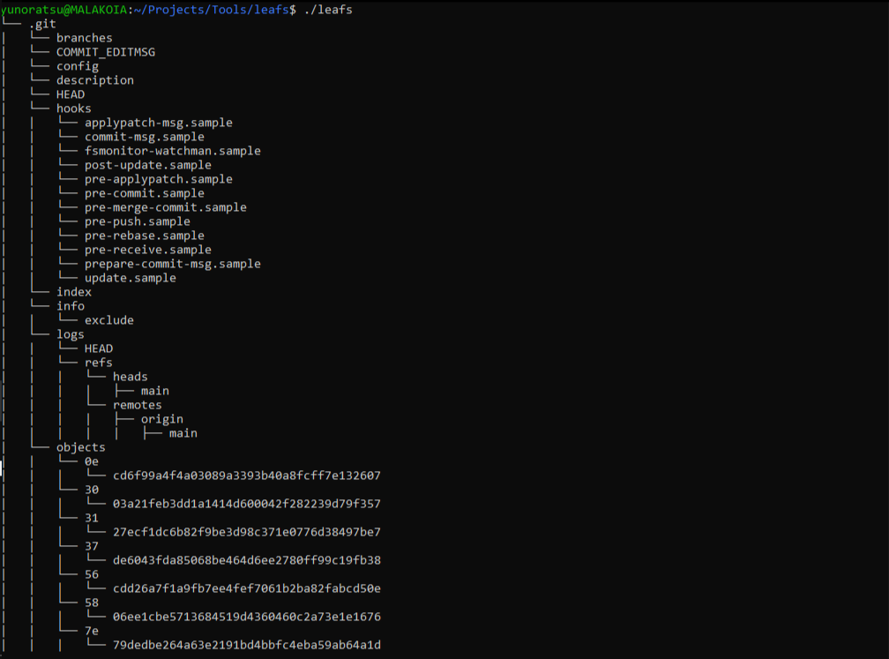

# My Tree (Leafs)

  

Leafs is a lightweight reimplementation of the classic `tree` command for Linux.  
It recursively lists directory contents in a structured, tree-like format.

## Features
- Displays directories and files in a hierarchical tree view
- Supports nested depth visualization
- Colored error messages for better readability
- Simple and lightweight C implementation

## Compatibility
- Tested on **Ubuntu 22.04**
- Should work on most Linux distributions with GCC and standard libraries

## Build & Install
```bash
git clone https://github.com/Yunoratsu/leafs.git
cd leafs
make
sudo cp leafs /usr/local/bin/
